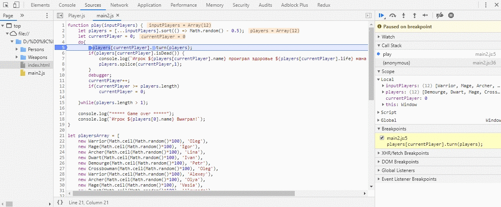
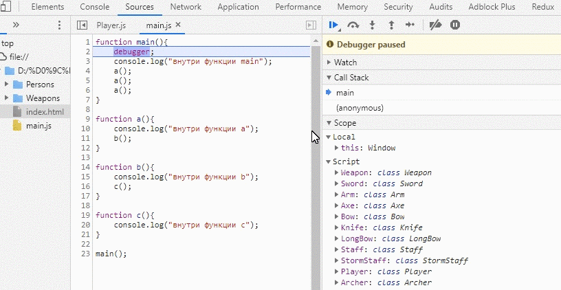
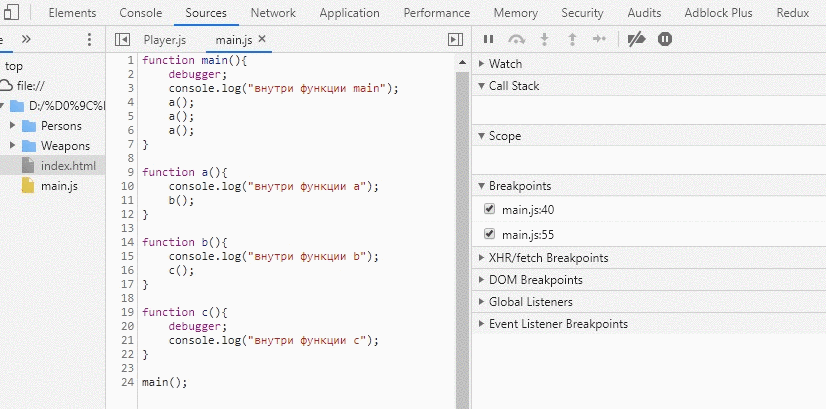
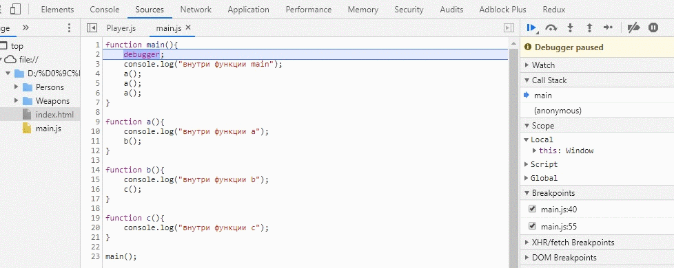
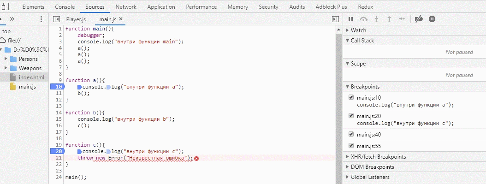
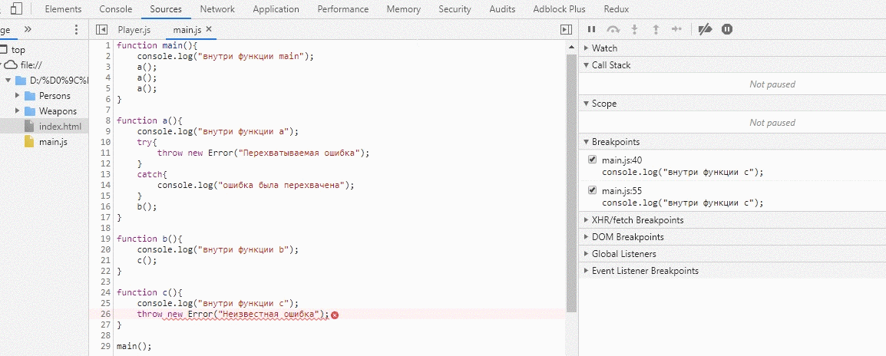
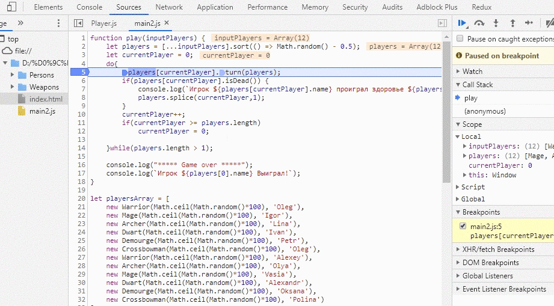
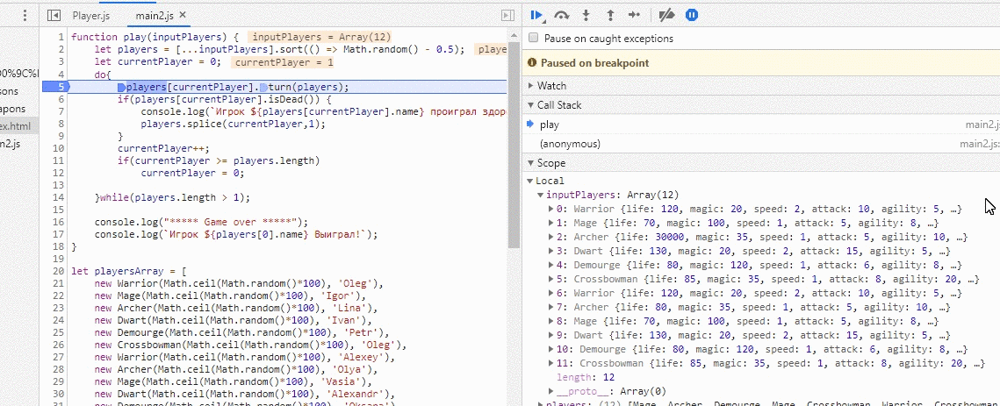

# Базовые принципы отладки

Очень часто новички пишут код, нажимают кнопку выполнить, получают результат. Если результат не такой, как ожидался, то возникают вопросы: почему код ведёт себя не так, как ожидалось? или где скрывается ошибка?
Бывают ситуации, что разработчику попадается унаследованный код и нужно разобраться как он выполняется. Вывод на консоль каких-нибудь данных, значения переменных могут помочь, но если код слишком большой, то в этих локах можно запутаться, что за чем следует.
Итак, мы выявили общую проблему: есть код (свой или чужой), который нужно понять. Как он выполняется?

> Отладка – это процесс поиска и исправления ошибок в скрипте. Все современные браузеры и большинство других сред разработки поддерживают инструменты для отладки – специальный графический интерфейс, который сильно упрощает отладку. Он также позволяет по шагам отследить, что именно происходит в нашем коде.

Так как же начать отлаживать код?

## Точки останова (breakpoints)
Для того, что бы зайти в режим отладчика, необходимо установить точку останова, после которой можно будет выполнять код по шагам.
Что бы поставить точку останова следует нажать на строку кода:

*gif №1*

Либо написать ключевое слово `debugger`

*gif №2*

## Пошаговое выполнение кода
После приостановки выполнения кода можно выполнить некоторые команды:

*изображение №1*

1) Продолжить выполнение. Быстрая клавиша – F8. (Во время выполнения можно поставить на паузу). - Продемонстрировано на `gif №1` и `gif №2`.

2) Сделать шаг (выполнить следующую команду), не заходя в функцию. Быстрая клавиша – F10. Продемонстрировано на `gif №3`.

3) Сделать шаг. Быстрая клавиша – F11. В этом случае мы «заходим» во вложенные функции и шаг за шагом проходим по скрипту. Продемонстрировано на `gif №3`.

4) Продолжить выполнение до завершения текущей функции. Быстрая клавиша – Shift+F11. (Выйти из функции). Продемонстрировано на `gif №4`.

5) Новая кнопка сделать шаг внутрь. Эта новая кнопка «Шаг F9» работает так же, как и старая кнопка «шаг в». Только используется для отладки асинхронных функций. [подробней](https://developers.google.com/web/updates/2018/01/devtools#async)

6) Активировать/деактивировать все точки останова. Продемонстрировано на `gif №2`.

7) Разрешить/запретить остановку выполнения в случае возникновения ошибки. Продемонстрировано на `gif №3`.

*gif №3* - переход к следующей конструкции и переход внутрь конструкции

*gif №4* - выход из функции

*gif №5* - остановка на ошибках

# Просмотр переменных и изменение переменных
После остановки выполнения кода актуально узнать, какие значения хранятся в данных переменных. Сделать это можно несколькими способами:

1) Просто навести курсор на нужную переменную

2) Посмотреть переменную в области Scope

3) Добавить переменную в область Watches

4) Воспользоваться консолью

*gif №6* - просмотр и изменение значенй переменных

# Call Stack - стек вызова

Рядом с верхней частью боковой панели находится раздел Call Stack. Когда код ставится на паузу в точке останова, стек вызовов показывает путь выполнения в обратном хронологическом порядке, который привел код к этой точке останова. Это полезно для понимания не только того, где сейчас находится выполнение, но и как оно туда попало, что является важным фактором при отладке. Значок синей стрелки показывает, какая функция DevTools выделяет в данный момент.

*gif №7* - Call Stack

# Watch - область просмотра значений
Chrome DevTools позволяет вам легко увидеть несколько переменных в вашем приложении. Панель Watch предоставляет возможность просмотра переменных в вашем приложении. Она находится в разделе просмотра боковой панели отладчика.

*изображение №2*

Чтобы добавить переменную в список просматриваемых, используйте значок добавления справа от заголовка раздела. Это откроет встроенный ввод, где вы предоставите имя переменной для просмотра. Как только он будет заполнен, нажмите клавишу enter, чтобы добавить его в список.

Значения переменных могут измениться, поскольку приложение продолжает работать. Наблюдаемый список не является отображением переменных в реальном времени, если вы не выполняете пошаговое выполнение. Когда вы выполняете пошаговое выполнение с использованием точек останова, наблюдаемые значения обновляются автоматически. Чтобы вручную проверить переменные в списке, нажмите кнопку обновления справа от заголовка раздела.

Чтобы сохранить то, что вы ищете на минимальном уровне для более быстрой работы, вам может потребоваться удалить переменные из списка наблюдения. Это можно сделать, наведя указатель мыши на переменную, а затем щелкнув значок удаления, который отображается справа.
*gif №8* - Watch

# Scope - область видимости

Когда вы приостанавливаете сценарий, на панели «Scope» отображаются все определенные на данный момент свойства в данный момент времени.

Панель «Scope» заполняется только тогда, когда сценарий приостановлен. Пока ваша страница запущена, панель Scope пуста. На панели отображаются свойства, определенные на локальном, закрытом и глобальном уровнях.

Панель «Scope» схожа с панелю «Watch». Отличием является то, что в эту панель не нужно добавлять никаких отслеживаемых значений. Она показывает все локальные значения.

*Продемонстрировано на gif №6*

# Breakpoints - точки останова
Весь процесс отладки основан на остановке выполнения кода, выполнении кода по шагам и просмотре значения переменных при выполнении. Поэтому установка точек останова является начальным действием при отладке. 
Все точки останова можно посмотреть в блоке Breakpoints. Там же можно посмотреть где они находятся, а так же можно отключать их по отдельности.
Так же можно делать условия для остановки выполнения кода в указанном месте. Для этого нужно нажать правой кнопкой мыши на точке останова, затем *edit breakpoint* и после этого ввести условие для остановки выполнения.

*gif №9* - Breakpoints

# Просмотр HTML элементов в браузере
Так как JavaScript разрабатывался для написания клиентской логики и работы на веб-странице, то и отладка JavaScript во взаимодействии с HTML страницей тоже присутствует и в переменных можно сразу видеть, какие элементы находятся в переменной

*gif №10* - Работа с веб-страницей

