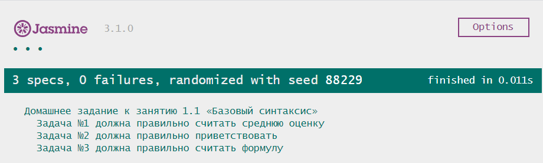

# Домашнее задание к занятию 1.1 «Базовый синтаксис»

Вы курируете местную школу в части информационных технологий. Персонал школы и учащиеся данного заведения видят в вас высококвалифицированного специалиста и мастера своего дела. Они обращаются к вам за помощью в написании программ, и вы им с радостью помогаете. Ведь для вас это не составляет никакого труда.

## Задача № 1
Мария Степановна работает завучем в школе. Все бы ничего, но ее совсем замучили бумажные журналы, и она решила сделать электронный журнал. Решила Мария Степановна начать с расчета средней оценки ученика по предметам. Помогите Марии написать программу, которая сможет подсчитать среднюю оценку за 3 занятия и вывести результат.

### Процесс реализации
1. Объявите три переменные:
  * algebra;
  * geography;
  * physics.

2. Задайте переменным значения в соответствии с аргументами функции.

3. Составьте выражение, используя переменные и математические операторы и вычислите среднюю оценку за три предмета.

4. Присвойте результат новой переменной и верните его из функции.

## Задача № 2
Журнал, который сделала Мария Степановна, понравился ее коллегам, поэтому, ей пришлось добавить туда личный кабинет. Для начала нужно написать приветственное обращение на экране. Текст обращения: `Привет, мир! Меня зовут <ваше имя>`.

### Процесс реализации
1. Объявите переменную `myName` и присвойте ей значение из аргумента функции.

2. Используя шаблоны для подстановки значений, сформируйте соответствующее сообщение и запишите результат в переменную `message`.

3. Верните полученный результат из функции.

## Задача № 3

> Задача со "звездочкой", ее выполнение не влияет на получение допуска до дипломной работы, но принесет много полезного опыта.

Ученику 7 класса ”Б” Васе очень не нравится решать примеры, зато ему нравится программирование. Но пока он не очень хорошо разбирается в нем. Помогите Васе в трудной ситуации и напишите программу, которая решит следующий пример: `x * y + 5 * z + x - 1`, где `x = 2`, `y = 22`, `z = 0` и выведет результат на экран.

### Процесс реализации:
1. Объявите три переменные:
  * x;
  * y;
  * z.

2. Задайте созданным переменным соответствующие значения:
  * x: 2;
  * y: 22;
  * z: 0.

3. Вычислите ответ для примера `x * y + 5 * z + x - 1` и запишите его в переменную `result`;

4. Верните полученный результат из функции.

## Требования для выполнения домашней работы

* браузер;
* редактор кода, например [Sublime][1] или [Visual Studio Code][2];
* аккаунт на [GitHub][0] ([инструкция по регистрации на GitHub][3]);
* система контроля версий [Git][4], установленная локально ([инструкция по установке Git][5]);
* запуск всех тестов должен успешно выполнять все тесты:

## Решение задач
1. Перейти в папку задания. `cd ./1.1-variables`.
2. Открыть файл `task.js` в вашем редакторе кода и выполнить задание.
3. Самостоятельно вызывать функции не требуется, если это не требуется по заданию.
4. Открыть файл `index.html` в вашем браузере и с помощью консоли DevTools убедиться в правильности выводимых результатов.
5. Добавить файл `task.js` в индекс git с помощью команды `git add %file-path%`, где %file-path% - путь до целевого файла. `git add task.js`.
6. Сделать коммит используя команду `git commit -m '%comment%'`, где %comment% - это произвольный комментарий к вашему коммиту. `git commit -m 'first commit variables'`.
7. Опубликовать код в репозиторий homeworks с помощью команды `git push -u origin master`.
8. Прислать ссылку на репозиторий через личный кабинет на сайте [Нетологии][6].

[0]: https://github.com/
[1]: https://www.sublimetext.com/
[2]: https://code.visualstudio.com/
[3]: https://github.com/netology-code/guides/tree/master/github
[4]: https://git-scm.com/
[5]: https://github.com/netology-code/guides/blob/master/git/REAMDE.md
[6]: https://netology.ru/

*Никаких файлов прикреплять не нужно.*

Все задачи обязательны к выполнению для получения зачета. Присылать на проверку можно каждую задачу по отдельности или все задачи вместе. Во время проверки по частям ваша домашняя работа будет со статусом "На доработке".

Любые вопросы по решению задач задавайте в Slack-канале.

