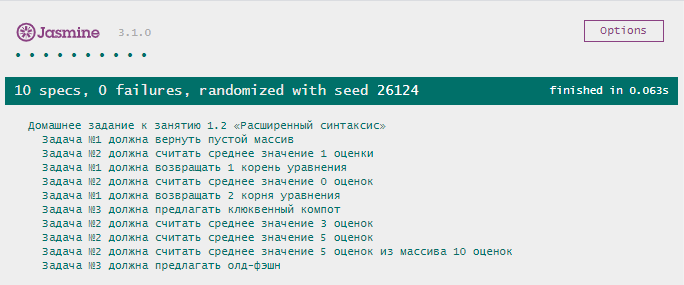

# Домашнее задание к занятию 1.2 «Расширенный синтаксис»

## Задача № 1

Наш знакомый школьник Вася с вашей помощью разобрался как решать несложные примеры при помощи программ. А как быть с квадратными уравнениями? Ему опять потребовалась ваша помощь: напишите программу, которая решит квадратное уравнение 2x^2+4x-3=0.

### Процесс реализации:
1. Активируйте строгий режим соответствия.

2. Реализуйте функцию getResult(), которая принимает 3 аргумента: a, b,c - коэффициенты квадратного уравнения.

3. Вычислите дискриминант для решения уравнения. Для возведения в степень используйте оператор - ** или функцию Math.pow().

4. Результатом функции должен быть **массив**.

5. Если дискриминант меньше нуля, то корней нету. (пустой массив)

6. Если дискриминант равен нулю, то корень один. Его необходимо вычислить и вернуть из функции. (массив с одним корнем).

7. Если дискриминант больше нуля, то существует 2 решения уравнения. Их необходимо вычислить и вернуть из функции. (массив с двумя корнями).

## Задача № 2

Программа, которой Мария Степановна пользовалась для подсчета оценок, произвела фурор среди ее коллег! Только вот незадача, она может рассчитать только среднюю оценку только если оценок было три. Расширьте программу так, чтобы она принимала массив, в котором может быть не больше 5 оценок, а может и меньше (оценка, если ее не поставили, не будет считаться). На выходе программа должна выдавать среднюю отметку. Если аргументов больше 5, вывести это на консоль, и считать только первые 5.

### Процесс реализации:
1. Реализуйте функцию getAverageMark(), которая принимает 1 аргумент marks, который содержит оценки. (В поле для ввода вводить положительный набор цифр, разделенных пробелом или запятой).

2. Проверить количество введенных оценок.

3. Если оценок нет и массив пустой, то нет смысла считать среднюю оценку: просто верните `0`.

4. Если количество оценок больше 5, то вывести соответствующую информацию на консоль, а так же обрезать исходный массив. Для обрезания массива можно использовать методы ```slice``` или ```splice```

5. Накапливать сумму всех оценок.

6. Вернуть из функции среднее значение оценок, тоесть результат деления суммы оценок на их количество

7. Избегайте дублирования логики и любого копипаста

## Задача № 3

> Задача со "звездочкой", ее выполнение не влияет на получение допуска до дипломной работы, но принесет много полезного опыта.

Напишите программу для бармена-андроида Арчи. Программа должна принимать имя пользователя и год рождения. Если пользователь старше 18 лет, то программа должна выводить на экран текст “Не желаете ли олд-фэшн, <имя пользователя>?”, а если младше, то: “Сожалею, <имя пользователя>, но я не могу вам продать алкоголь. Зато могу предложить вам замечательный клюквенный компот!”

### Процесс реализации:
1. Реализуйте функцию askDrink(), которая принимает 2 аргумента: name и dateOfBirthday. 

2. Расчитайте возраст пользователя. (Для получения года из даты воспользуйтесь функцией getFullYear()).

3. Для получения текущей даты создайте объект new Date().

4. Вернуть из функции результирующую строку.

## Требования для выполнения домашней работы

* браузер;
* редактор кода, например [Sublime][1] или [Visual Studio Code][2];
* аккаунт на [GitHub][0] ([инструкция по регистрации на GitHub][3]);
* система контроля версий [Git][4], установленная локально ([инструкция по установке Git][5]);
* запуск всех тестов должен успешно выполнять все тесты:


## Решение задач
1. Перейти в папку задания. `cd ./1.2-extended-syntax`.
2. Открыть файл `task.js` в вашем редакторе кода и выполнить задание.
3. Открыть файл `index.html` в вашем браузере и убедиться в правильности выводимых результатов.
4. Добавить файл `task.js` в индекс git с помощью команды `git add %file-path%`, где %file-path% - путь до целевого файла. `git add task.js`.
5. Сделать коммит используя команду `git commit -m '%comment%'`, где %comment% - это произвольный комментарий к вашему коммиту. `git commit -m 'first commit extended-syntax'`.
6. Опубликовать код в репозиторий homeworks с помощью команды `git push -u origin master`.
7. Прислать ссылку на репозиторий через личный кабинет на сайте [Нетологии][6].

[0]: https://github.com/
[1]: https://www.sublimetext.com/
[2]: https://code.visualstudio.com/
[3]: https://github.com/netology-code/guides/tree/master/github
[4]: https://git-scm.com/
[5]: https://github.com/netology-code/guides/blob/master/git/REAMDE.md
[6]: https://netology.ru/

*Никаких файлов прикреплять не нужно.*

Присылать на проверку можно каждую задачу по отдельности или все задачи вместе. Во время проверки по частям ваша домашняя работа будет со статусом "На доработке".

Любые вопросы по решению задач задавайте в Slack-канале.
