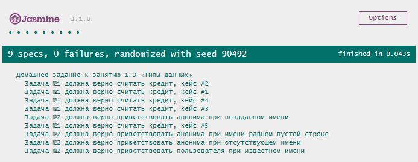

# Домашнее задание к лекции 1.3 «Типы данных»

## Задача № 1

Банку “Капитал Кэпиталс” потребовалось написать калькулятор для расчета выплат по ипотеке, и они решили поручить эту задачу вам. 

Напишите функцию, которая будет принимать процентную ставку, сумму первоначального взноса, сумму кредита и срок (дату окончания кредита) в качестве аргументов и выдавать сумму, которую в итоге заплатит клиент (первоначальный взнос, погашение основного долга, проценты за пользование кредитом). 

Не забывайте, что вы должны работать с числами: если параметр функции будет строкой, то попытайтесь преобразовать в число. Во всех остальных случаях возвращайте строку: “Параметр <название параметра> содержит неправильное значение <значение параметра>”.

Обратите внимание, что в инпуте пользователь указывает конечную дату, поэтому в функции необходимо посчитать срок в месяцах на основе введеной даты.

### Процесс реализации:
1) Активируйте строгий режим соответствия.
2) Проконтролируйте корректность введенных данных.
3) Посчитайте тело кредита: сумма, которую необходимо вернуть банку. (сумма кредита минус первоначальный взнос).
4) Посчитайте количество выплачиваемых месяцев.
5) Ежемесячная оплата рассчитывается по формуле:
Платеж=S*(P+P/(((1+P)^n)-1)), где:
S - тело кредита, P - 1/12 процентной ставки (от 0 до 1), n - количество месяцев
^ - возведение в степень
6) Посчитайте общую сумму, которую придется заплатить клиенту.
7) Округлите результат до двух значений после запятой.
8) Выведите результат в консоль, а также верните его из функции. Результатом функции должно быть значение числового типа.

Примеры результатов:

Ввод: процент*100, начальный взнос, сумма кредита, срок в месяцах

Ввод: 10,0,50000,12. Вывод: 52749.53

Ввод: 10,1000,50000,12. Вывод: 51694.54

Ввод: 10,0,20000,24. Вывод: 22149.56

Ввод: 10,1000,20000,24. Вывод: 21042.09

Ввод: 10,20000,20000,24. Вывод: 0

Ввод: 10,0,10000,36. Вывод: 11616.19 

Ввод: 15,0,10000,36. Вывод:  12479.52

**ВАЖНО**
В п.п.5 P - процентная ставка должна быть дробным числом, следовательно, входные данные нужно разделить на 100.

## Задача № 2

Марии Степановне потребовалась возможность добавить анонимных пользователей в электронный журнал (чтобы ученики не знали, что их родители там есть). Для этого напишите функцию, которая принимает имя пользователя и выводит на экран приветствие: “Привет, мир! Меня зовут <ваше имя>”. Если имя не введено, то выведите вместо имени слово “Аноним”.

### Процесс реализации:
1) Реализуйте функцию, которая принимает имя пользователя.
3) Проверьте наличие имени и замените его на “Аноним” в случае отсутствия.
2) Функция должна вернуть корректное приветствие, а также выведите результат в консоль.

Примеры результатов:

Ввод: Иван. Вывод: Привет, мир! Меня зовут Иван.

Ввод: Анастасия. Вывод: Привет, мир! Меня зовут Анастасия.

Ввод: Петр. Вывод: Привет, мир! Меня зовут Петр.

Ввод: null. Вывод: Привет, мир! Меня зовут Аноним.

Ввод: "". Вывод: Привет, мир! Меня зовут Аноним.

Ввод: undefined. Вывод: Привет, мир! Меня зовут Аноним.

## Требования для выполнения домашней работы

* браузер;
* редактор кода, например [Sublime][1] или [Visual Studio Code][2];
* аккаунт на [GitHub][0] ([инструкция по регистрации на GitHub][3]);
* система контроля версий [Git][4], установленная локально ([инструкция по установке Git][5]);
* запуск всех тестов должен успешно выполнять все тесты:

## Решение задач
1. Перейти в папку задания. `cd ./1.3-data-types`.
2. Открыть файл `task.js` в вашем редакторе кода и выполнить задание.
3. Открыть файл `task.html` в вашем браузере и убедиться в правильности выводимых результатов.
4. Добавить файл `task.js` в индекс git с помощью команды `git add %file-path%`, где %file-path% - путь до целевого файла. `git add task.js`.
5. Сделать коммит используя команду `git commit -m '%comment%'`, где %comment% - это произвольный комментарий к вашему коммиту. `git commit -m 'first commit wrappers-for-primitives'`.
6. Опубликовать код в репозиторий homeworks с помощью команды `git push -u origin master`.
7. Прислать ссылку на репозиторий через личный кабинет на сайте [Нетологии][6].

[0]: https://github.com/
[1]: https://www.sublimetext.com/
[2]: https://code.visualstudio.com/
[3]: https://github.com/netology-code/guides/blob/master/git/github.md
[4]: https://git-scm.com/
[5]: https://github.com/netology-code/guides/blob/master/git/REAMDE.md
[6]: https://netology.ru/

*Никаких файлов прикреплять не нужно.*

Все задачи обязательны к выполнению для получения зачета. Присылать на проверку можно каждую задачу по отдельности или все задачи вместе. Во время проверки по частям ваша домашняя работа будет со статусом "На доработке".

Любые вопросы по решению задач задавайте в Slack-канале.
