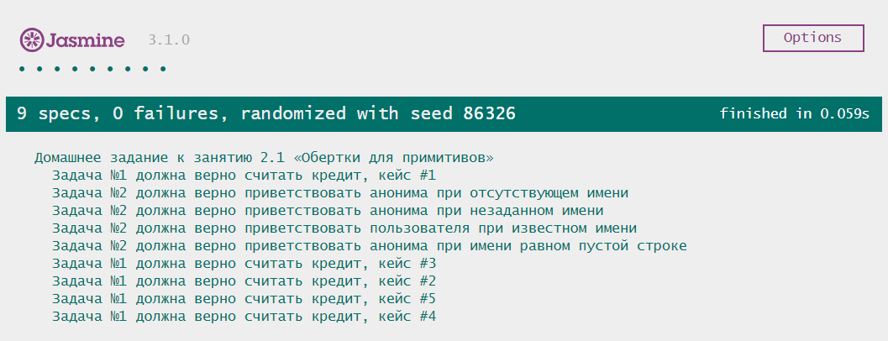

# Домашнее задание к занятию 2.1 «Функции, объекты» 

## Задача №1. Корни квадратного уравнения

Программы Васи приобрели большую популярность в классе. К сожалению, остальные ученики не очень разбираются в коде и не могут сами менять значения и нужно упростить им пользование. Расширьте программу, которая решала квадратное уравнение и напишите функцию, которая будет принимать коэффициенты a, b и c и выдавать результат.

### Процесс реализации

Разбит на 2 функции: первая вычисляет значения, вторая выдаёт понятное простому человеку описание.

**1. Функция getSolutions**

1. Создайте функцию *getSolutions( a, b, c )*, которая принимает, соответственно, 3 аргумента - коэффициенты квадратного уравнения.
2. Добавьте в функцию переменную **D**. Запишите туда значение дискриминанта квадратного уравнения, вычисляемого по формуле ```D = b² - 4ac```.
3. В случае, если дискриминант отрицательный, функция *getSolutions* должна вернуть ```{ D: значение_дискриминанта, roots: [] }```.
4. При дискриминанте, равном нулю:
	1. Создайте в функции переменную **x1** и поместите туда значение единственного корня квадратного уравнения, вычисляемого по формуле ```x1 = -b / 2a```.
	2. Верните в качестве результата работы функции *getSolutions* объект вида ```{ D: значение_дискриминанта, roots: [ значение_x1 ] }```.
5. При дискриминанте больше нуля:
	1. Создайте переменные **x1** и **x2** и поместите туда значения корней квадратного уравнения, вычисляемых по формулам ```x1 = (-b + √D) / 2a``` и ```x2 = (-b - √D) / 2a``` соответственно.
	2. Верните в качестве результата работы функции *getSolutions* объект вида ```{ D: значение_дискриминанта, roots: [ значение_x1,  значение_x2 ] }```.


**2. Функция showSolutionsMessage**

1. Создайте функцию *showSolutionsMessage( a, b, c )*, которая, как и функция *getSolutions*, принимает 3 аргумента - коэффициенты квадратного уравнения.
2. Создайте переменную **result**, в которую необходимо поместить результат работы *getSolutions( a, b, c )*.
3. Выведите сообщение: *«Вычисляем корни квадратного уравнения ax² + bx + c»*. Значение переданных a, b и c должны присутствовать в формуле.
4. Выведите сообщение: *«Значение дискриминанта: D»*. Значение дискриминанта вы можете взять из объекта **result**.
5. В зависимости от полученного в **result** результата, выведите сообщения:
	1. При отсутствии корней: *«Уравнение не имеет вещественных корней»*
	2. При одном корне: *«Уравнение имеет один корень X₁ = значение_корня»*
	3. При двух корнях: *«Уравнение имеет два корня. X₁ = значение\_корня\_1, X₂ = значение\_корня\_2»*

### Критерии выполнения

Задача считается выполненной, если вы проверили работу функции *showSolutionsMessage* для всех трёх случаев (нет вещественных корней, один корень, два корня). Пример:

### Примеры

**Пример вызова**


**Пример выполнения**


## Задача №2. Журнал успеваемости

Теперь Мария Степановна знаменита своей программой на весь район! Есть шанс, что такой журнал пригодится всем школам в городе, но для этого нужно сделать так, чтобы можно было посчитать среднее значение отметки для каждого предмета (их всего 10) и в целом среднюю отметку по всем предметам.


### Процесс реализации

1. Создайте функцию *getAverageScore(data)*, которая имеет аргумент *data*. В нём хранятся данные об оценках по предметам в формате, описанном ниже.
2. Создайте вспомогательную функцию *getAverageMark(marks)*, которая будет вычислять среднее значение массива.
3. Объект *data* формируется следующим образом (см. пример ниже):
	1. Имя свойства - имя предмета.
	2. Значение - массив оценок ученика. Оценок может быть произвольное количество.
4. В качестве результата, необходимо выдать объект со свойствами, обозначающими предмет и дополнительным свойством *average*, в котором хранится средняя отметка ученика по всем предметам (см. пример ниже).
5. При отсутствии оценок, средняя оценка по всем предметам должна быть равна 0.
6. Предусмотрите работу программы для случая, когда предметов в объекте *data* будет менее 10.

### Примеры

**Пример вызова**


**Пример выполнения**


## Задача №3. Расшифровка данных

> Задача со "звездочкой", ее выполнение не влияет на получение допуска до дипломной работы, но принесет много полезного опыта.

Агент 001 смог добыть флешку с секретными досье участников пиратской группировки “Pirates' home place” (PHP). Но вот беда, все данные зашифрованы при помощи шифра. Все, что удалось выяснить, это то, что на флешке записаны JS объекты. У всех есть по два свойства: ‘aaa’ и ‘bbb’. А значения у них либо 0, либо 1. Напишите программу, которая будет получать объект как на флешке, а выдавать такой объект, чтобы агент 001 смог разобраться и поймать негодяев! (Очень жаль, что агент не знает, что ‘aaa’ -- это имя, а ‘bbb’ -- это фамилия. 0 -- это “Родриго”, 1 -- это ”Эмильо”).


### Процесс реализации

1. Создайте функцию *getPersonData(secretData)*, которая имеет аргумент *secretData*, в котором будут храниться данные о пирате.
2. Создайте вспомогательную *getDecodedValue(secret)* функцию, которая по входному числу будет возвращать строку "Родриго" или "Эмильо".
3. В качестве результата выдайте объект формата ```{ firstName: имя_бандита, lastName: фамилия_бандита }```.
4. Проверьте функцию *getPersonData* минимум 4 раза. Создайте ситуации, при которых она выдаст следующие имена и фамилии: Родриго Родриго, Родриго Эмильо, Эмильо Родриго и Эмильо Эмильо.

### Примеры

**Пример вызова**


**Пример выполнения**


## Требования для выполнения домашней работы

* браузер;
* редактор кода, например [Sublime][1] или [Visual Studio Code][2];
* аккаунт на [GitHub][0] ([инструкция по регистрации на GitHub][3]);
* система контроля версий [Git][4], установленная локально ([инструкция по установке Git][5]);
* запуск всех тестов должен успешно выполнять все тесты:


## Решение задач
1. Перейти в папку задания. `cd ./2.1-functions`.
2. Открыть файл `task.js` в вашем редакторе кода и выполнить задание.
3. Открыть файл `index.html` в вашем браузере и с помощью консоли DevTools убедиться в правильности выводимых результатов.
4. Добавить файл `task.js` в индекс git с помощью команды `git add %file-path%`, где %file-path% - путь до целевого файла. `git add task.js`.
5. Сделать коммит используя команду `git commit -m '%comment%'`, где %comment% - это произвольный комментарий к вашему коммиту. `git commit -m 'first commit functions'`.
6. Опубликовать код в репозиторий homeworks с помощью команды `git push -u origin master`.
7. Прислать ссылку на репозиторий через личный кабинет на сайте [Нетологии][6].

[0]: https://github.com/
[1]: https://www.sublimetext.com/
[2]: https://code.visualstudio.com/
[3]: https://github.com/netology-code/guides/tree/master/github
[4]: https://git-scm.com/
[5]: https://github.com/netology-code/guides/blob/master/git/REAMDE.md
[6]: https://netology.ru/

*Никаких файлов прикреплять не нужно.*

Присылать на проверку можно каждую задачу по отдельности или все задачи вместе. Во время проверки по частям ваша домашняя работа будет со статусом "На доработке".

Любые вопросы по решению задач задавайте в Slack-канале.
