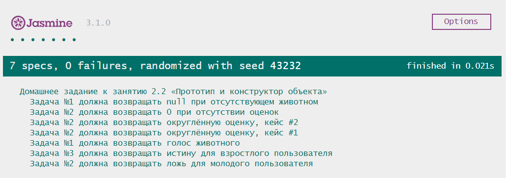

# Домашнее задание к лекции 2.2 «Прототип и конструктор объекта»

## Задача № 1

Нашему знакомому школьнику Васе потребовалось проверять читается ли строка справа налево так же как и слева направо. Но писать функцию для этого ему не интересно. Вася решил расширить сам язык JavaScript и добавить возможность проверки строки на полиндром.

### Процесс реализации
1. Используйте прототип класса `String` для добавления новой возможности
2. В прототип класса `String` добавьте функцию `isPalindrome`, которая будет проверять строку на полиндром
3. Используйте `this` для обращения к текущей строке на которой применяется функция
4. Не используйте стрелочную функцию (предпочитая обычную) для того, что бы не потерять контекст
5. Функция должна возвращать `true` если строка читается одинаково в любую сторону, и `false` если строка читается по-разному.
6. Реализуйте регистронезависимость функции
7. Проверьте вашу функцию: `console.log("А роза упала на лапу Азора")//true`

## Задача № 2

Марии Степановне очень пригодился журнал, который вы помогли разработать. Остаются, буквально, последние штрихи: для того, чтобы поставить оценку за четверть по предмету, учителю требуется округлить ее. Расширьте программу так, чтобы она выводила не только средний балл, но и округленный.

### Процесс реализации
1. Создайте функцию принимающую один аргумент `marks`, массив оценок ученика;
2. Подсчитайте средний бал ученика `average`, перебирая массив `marks`;
3. Округлите средний бал `average` до ближайшего целого, записав в переменную `roundedAverage`;
4. Верните результат работы функции - переменную `roundedAverage`.

## Задача № 3

> Задача со "звездочкой", ее выполнение не влияет на получение допуска до дипломной работы, но принесет много полезного опыта.

Бармен-андроид Арчи очень благодарен за ту программу, которую вы в него встроили. Однако, появилась проблема: знать год рождения посетителя оказалось недостаточным. Нужно знать еще и дату рождения, и уже на основе этого делать выводы. Расширьте программу так, чтобы она могла принимать полную дату рождения и выдавала результат в зависимости от текущей даты и времени.

### Процесс реализации
1. Получить текущую дату в Unix Timestamp и записать в переменную `now`;
2. Создать экземпляр `Date` с датой рождения пользователя (помните, что месяцы начинаются с 0, а даты с 1);
3. Получить Unix Timestamp даты рождения пользователя и записать в переменную `birthday`;
4. Посчитать разницу между `birthday` и `now` в миллисекундах, сохранив в переменную `diff`;
5. Определить возраст пользователя `age`, разделив `diff` на количество миллисекунд в году (помните про високосные года);
6. Верните в качестве результата работы функции, анализ `age`, является ли клиент совершеннолетним ( > 18 лет). 

## Требования для выполнения домашней работы

* браузер;
* редактор кода, например [Sublime][1] или [Visual Studio Code][2];
* аккаунт на [GitHub][0] ([инструкция по регистрации на GitHub][3]);
* система контроля версий [Git][4], установленная локально ([инструкция по установке Git][5]);
* запуск всех тестов должен успешно выполнять все тесты:

## Решение задач
1. Перейти в папку задания. `cd ./2.2-object-prototype`.
2. Открыть файл `task.js` в вашем редакторе кода и выполнить задание.
3. Открыть файл `index.html` в вашем браузере и с помощью консоли DevTools убедиться в правильности выводимых результатов.
4. Добавить файл `task.js` в индекс git с помощью команды `git add %file-path%`, где %file-path% - путь до целевого файла. `git add task.js`.
5. Сделать коммит используя команду `git commit -m '%comment%'`, где %comment% - это произвольный комментарий к вашему коммиту. `git commit -m 'first commit object-prototype'`.
6. Опубликовать код в репозиторий homeworks с помощью команды `git push -u origin master`.
7. Прислать ссылку на репозиторий через личный кабинет на сайте [Нетологии][6].

[0]: https://github.com/
[1]: https://www.sublimetext.com/
[2]: https://code.visualstudio.com/
[3]: https://github.com/netology-code/guides/blob/master/git/github.md
[4]: https://git-scm.com/
[5]: https://github.com/netology-code/guides/blob/master/git/README.md
[6]: https://netology.ru/

*Никаких файлов прикреплять не нужно.*

Все задачи обязательны к выполнению для получения зачета. Присылать на проверку можно каждую задачу по отдельности или все задачи вместе. Во время проверки по частям ваша домашняя работа будет со статусом "На доработке".

Любые вопросы по решению задач задавайте в Slack-канале.
