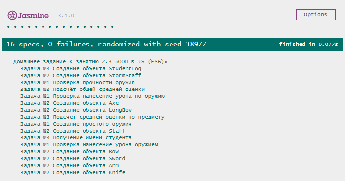

# Домашнее задание к лекции 2.3 «ООП в JS (ES6)» 

## Задача №1. Печатное издание

Мы помогаем перевести небольшую районную библиотеку в современный цифровой формат. Начнём с того, что реализуем несколько классов: классы печатных изданий (книг, журналов) и класс самой библиотеки, который позволит работать с печатными изданиями (хранить их, выдавать читателям, примать обратно).

### Процесс реализации

Печатные издания бывают различных типов, но между всеми книгами, сборниками и журналами есть много общего: все они имеют название, год издания, состоят из скольких-то страниц, а ещё могут портиться, пока люди ими пользуются. 

1. Создайте базовый класс `PrintEditionItem` со следующими свойствами:
    * `name` 
    * `releaseDate` 
    * `pagesCount` 
    * `state` 
    * `type` 

    Конструктор класса должен принимать название (`name`), дату выпуска (`releaseDate`) и количество страниц (`pagesCount`) в качестве аргумента. Состояние (`state`) по умолчанию должно устанавливаться равным `100`, тип `type` пока должен быть равен `null`.


2. Испорченное издание можно подклеить и тем самым улучшить его состояние. Создайте метод `fix()`, увеличивающий `state` в полтора раза. Метод не должен принимать аргументов.

3. Нельзя улучшить новое издание, и бесполезно подклеивать полностью уничтоженное. Для лучшего контроля над состоянием создайте «сеттер» для свойства `state`, принимающий в качестве аргумента новое состояние печатного издания (число).

    Если новое состояние меньше `0`, «сеттер» должен записать в свойство `state` значение `0`. Если новое состояние больше `100`, должно быть записано значение `100`. В остальных случаях в свойство `state` должно быть записано переданное в «сеттер» значение.
    
4. Создайте «геттер», который позволит читать значение свойства `state`.

*Пример использования*

```js
const sherlock = new PrintEditionItem("Полное собрание повестей и рассказов о Шерлоке Холмсе в одном томе", 2019, 1008);

console.log(sherlock.releaseDate); //2019
console.log(sherlock.state); //100
sherlock.fix();
console.log(sherlock.state); //100

```

5. Создайте класс `Magazine`, который будет наследоваться от класса `PrintEditionItem`. Конструктор класса должен принимать такие же параметры, как и класс-родитель. От базового печатного издания журнал отличается только явно указанным типом. Значение свойства `type` должно быть равно `"magazine"`.

6. Создайте класс `Book`, наследующийся от класса `PrintEditionItem`. Конструктор класса должен принимать такие же параметры, как и класс-родитель, а также имя автора книги `author`. Значение свойства `type` должно быть равно `"book"`.

7. Создайте классы `NovelBook` для романов, `FantasticBook` для фантастических произведений и `DetectiveBook` для детективов, наследующиеся от класса `Book`. Значения свойства `type` должны быть равны `"novel"`, `"fantastic"` и `"detective"` соответственно.

*Пример использования*

```js
const picknick = new FantasticBook("Аркадий и Борис Стругацкие", "Пикник на обочине", 1972, 168);

console.log(picknick.author); //"Аркадий и Борис Стругацкие"
picknick.state = 10;
console.log(picknick.state); //10
picknick.fix();
console.log(picknick.state); //15
```

## Задача №2. Библиотека

Теперь с помощью классов можно описать все возможные печатные издания, которые бывают в библиотеке. Пришло время подготовить саму библиотеку к работе в цифровом режиме: нужно реализовать возможности хранить книги, выдавать их читателям и принимать обратно.

### Процесс реализации

1. Создайте класс `Library` со следующими свойствами:
    * `name`
    * `books`

    Конструктор класса должен принимать название библиотеки `name` (строка). Значением свойства `books` должен быть пустой массив.

2. Реализуйте метод `addBook(book)`, который будет в качестве аргумента принимать объект (книгу или журнал). Метод должен добавлять книгу в хранилище `books`, только если состояние `state` книги больше `30`. 

3. Создайте метод `findBookBy(type, value)`, который в качестве аргументов будет принимать ключ, по которому будет производиться поиск (тип, автор, название, год выпуска и пр.) и искомое значение. Метод должен возвращать книгу в случае успеха и `null`, если запрошенная книга не была найдена.

4. Создайте метод `giveBookByName(bookName)`, который будет в качестве аргумента принимать название книги, запрошенной читателем. Если запрошенная книга найдена, метод должен удалять книгу из хранилища `books`, и возвращать её. Если книга не была найдена, метод должен возвращать `null`.

*Пример использования*

```js
const library = new Library("Библиотека имени Ленина");

library.addBook(new DetectiveBook("Артур Конан Дойл", "Полное собрание повестей и рассказов о Шерлоке Холмсе в одном томе", 2019, 1008));
library.addBook(new FantasticBook("Аркадий и Борис Стругацкие", "Пикник на обочине", 1972, 168));
library.addBook(new NovelBook("Герберт Уэллс", "Машина времени", 1895, 138));
library.addBook(new Magazine("Мурзилка", 1924, 60));

console.log(library.findBookBy("name", "Властелин колец")); //null
console.log(library.findBookBy("releaseDate", 1924).name); //"Мурзилка"

console.log("Количество книг до выдачи: " + library.books.length); //Количество книг до выдачи: 4
library.giveBookByName("Машина времени");
console.log("Количество книг после выдачи: " + library.books.length); //Количество книг после выдачи: 3
```

5. Протестируйте корректность работы классов и методов, разыграв тестовый сценарий:
    * Создайте библиотеку;
    * Добавьте в библиотеку несколько печатных изданий различных типов;
    * Найдите книгу, изданную в 1919 году (создайте такую книгу при необходимости);
    * Выдайте любую книгу;
    * Испортите выданную книгу;
    * Почините выданную книгу;
    * Попытайтесь добавить починенную книгу обратно в библиотеку.
    
## Задача №3. Школьный журнал

> Это задача со "звездочкой", ее выполнение не влияет на получение допуска до дипломной работы, но принесет много полезного опыта.

Мария Степановна продолжает совершенствовать журнал. Теперь для его ведения она 
решила создать специальный класс *StudentLog*, который бы помог ей удобно вносить 
новые оценки и автоматически пересчитывать средние показатели.
Реализуйте в классе StudentLog следующие функции:
- внесение оценки по названию предмета;
- получение средней оценки по предмету;
- получение средней оценки по всем предметам.


### Процесс реализации

Реализуйте класс «StudentLog»:

1. Передавайте в *конструктор экземпляра* имя ученика:

```js
const log = new StudentLog('Олег Никифоров');
```

2. Создайте метод *getName*, возвращающее имя ученика: 

```js
const log = new StudentLog('Олег Никифоров');
console.log(log.getName()) // Олег Никифоров
```

3. Создайте метод `addGrade(grade, subject)`, который будет вносить оценку 
по соответствующему предмету. При этом `grade` — оценка, `subject` — предмет.
Условия работы метода:
+ Метод возвращает количество поставленных оценок по данному предмету. 
+ Оценка ставится числом в пределах от 1 до 5. 
+ **При неверной оценке дополнительно выдаётся сообщение с ошибкой, 
оценка в журнал не заносится**. Текущее количество оценок все равно требуется вернуть.

```js
const log = new StudentLog('Олег Никифоров');

console.log(log.addGrade(3, 'algebra'));
// 1

console.log(log.addGrade('отлично!', 'math'));
// Вы пытались поставить оценку "отлично!" по предмету "math". Допускаются только числа от 1 до 5.
// 0

console.log(log.addGrade(4, 'algebra'));
// 2

console.log(log.addGrade(5, 'geometry'));
// 1

console.log(log.addGrade(25, 'geometry'));
// Вы пытались поставить оценку "25" по предмету "geometry". Допускаются только числа от 1 до 5.
// 1
```

3. Создайте метод `getAverageBySubject(subject)`, получающий среднюю оценку по названию предмета. При отсутствии предмета нужно выдать 0.

```js
const log = new StudentLog('Олег Никифоров');

log.addGrade(2, 'algebra');
log.addGrade(4, 'algebra');
log.addGrade(5, 'geometry');
log.addGrade(4, 'geometry');

console.log(log.getAverageBySubject('geometry')); // 4.5
console.log(log.getAverageBySubject('algebra')); // 3
console.log(log.getAverageBySubject('math')); // 0
```

4. Создайте метод `getTotalAverage()`, получающий среднюю оценку по всем предметам. Средняя оценка рассчитывается как сумма **всех** оценок на их количество. При отсутствии оценок нужно выдать 0.

```js
const log = new StudentLog('Олег Никифоров');

log.addGrade(2, 'algebra');
log.addGrade(4, 'algebra');
log.addGrade(5, 'geometry');
log.addGrade(4, 'geometry');

console.log(log.getTotalAverage()); // 3,75
```

### Критерии выполнения

Реализованы все методы, в каждом из которых вы привели примеры работы
исключительных случаев (неверный формат оценки, несуществующий предмет и т.д).

## Требования для выполнения домашней работы

* браузер;
* редактор кода, например [Sublime][1] или [Visual Studio Code][2];
* аккаунт на [GitHub][0] ([инструкция по регистрации на GitHub][3]);
* система контроля версий [Git][4], установленная локально ([инструкция по установке Git][5]);
* запуск всех тестов должен успешно выполнять все тесты:



## Решение задач
1. Перейти в папку задания, например, для первого задания `cd ./2.3-oop-es6`.
2. Открыть файл `task.js` в вашем редакторе кода и выполнить задание.
3. Открыть файл `index.html` в вашем браузере и с помощью консоли DevTools убедиться в правильности выводимых результатов.
4. Добавить файл `task.js` в индекс git с помощью команды `git add %file-path%`, где %file-path% - путь до целевого файла, например, для первого задания `git add oop-es6/task.js`.
5. Сделать коммит используя команду `git commit -m '%comment%'`, где %comment% - это произвольный комментарий к вашему коммиту, например, для первого задания 'first commit oop-es6'.
6. Опубликовать код в репозиторий homeworks с помощью команды `git push -u homeworks master`.
7. Прислать ссылку на репозиторий через личный кабинет на сайте [Нетологии][6].

[0]: https://github.com/
[1]: https://www.sublimetext.com/
[2]: https://code.visualstudio.com/
[3]: https://github.com/netology-code/guides/blob/master/git/github.md
[4]: https://git-scm.com/
[5]: https://github.com/netology-code/guides/blob/master/git/REAMDE.md
[6]: https://netology.ru/

*Никаких файлов прикреплять не нужно.*

Присылать на проверку можно каждую задачу по отдельности или все задачи вместе. Во время проверки по частям ваша домашняя работа будет со статусом «На доработке».

Любые вопросы по решению задач задавайте в Slack-канале.