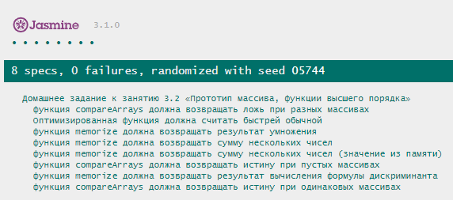

# Домашнее задание к занятию 3.2 «Прототип массива, функции высшего порядка» 

## Задача №1. Практика функций высшего порядка
В качестве практики вам необходимо реализовать несколько функций. Весь код по этому заданию пишите в файле `functions.js`.
* Вспомните задание с отладкой. Оружия из того задания вам пригодятся для практики изученных функций.
* Так как в файл подключается RPG-игра, в которой присутствует много вывода, то для удобства следует убрать весь вывод игры. Используйте `console.clear();` для очистки консоли
* Создайте начальный массив оружий (используйте этот набор оружий в данном порядке):
```javascript
const weapons = [new Knife(), new Staff(), new Axe(), new StormStaff(), new LongBow(), new Bow()];
```
* Все последующие функции следует реализовывать **без использования циклов**
* Напишите функцию `getNames`, которая будет возвращать имена всех оружий.
* Напишите функцию `getCountReliableWeapons`, которая принимает значение прочности и возвращает количество оружий больше принимаемой прочности
* Напишите функцию `hasReliableWeapons`, которая принимает значение прочности и возвращает вердикт: есть ли оружия прочней принимаемой прочности?
* Напишите функцию `getReliableWeaponsNames`, которая принимает значение прочности и возвращает имена оружий, которые прочней полученного значения.
* Напишите функцию `getTotalDamage`, которая вернёт общую сумму урона всех оружий.
* *Необязательно*. Напишите функцию, которая принимает массив чисел и значение суммы, а возвращает значение количества чисел, которое необходимо суммировать до получения переданной суммы. Если набранной суммы не хватает, то возвращает общее количество элементов.
```javascript
//возвращает 4, т.к. 1+2+3=6 (3 числа), а 1+2+3+5=11 (4 числа)
getValuestCountToSumValues([1,2,3,5,2,7,3,5,2], 10);
//возвращает 6, т.к. 1+2+3+5+2=13 (5 чисел), а 1+2+3+5+2+7=20 (6 чисел)
getValuestCountToSumValues([1,2,3,5,2,7,3,5,2], 20);
```
**Внимание** Запуск тестов может зависать из-за неоптимальности RPG-игры. Проблема решается закрытием вкладки с тестами и повторным открытием.

## Задача №2. Ускорение долгих вычислений

Паша — разработчик из компании “Тындекс” встретился с такой проблемой: иногда функция может считать результат очень долго, даже когда ей передавались одинаковые параметры, ведь она каждый раз пересчитывает результат. 

Создайте функцию, которая сможет “запоминать” результаты другой функции, которую ей передают в качестве аргумента. 

Для того, чтобы запомненные результаты не занимали всю память, сделайте массив запомненных результатов ограниченным: когда элементов становится больше 10, то самый старый результат удаляется, а новый -- добавляется.

## 2.1 Подготовка к заданию

### 2.1.1. sleep 
Реализуйте функцию, эмулирующую продолжительную работу. Так как в JavaScript отсутствует стандартный механизм приостановки выполнения кода на определённый промежуток времени, а с асинхронным кодом вы ещё не знакомы, то реализуйте искуственное замедление любого кода:
```javascript
function sleep(milliseconds) 
{
  let e = new Date().getTime() + milliseconds;
  while (new Date().getTime() <= e) {}
}
```

### 2.1.2. sum
Реализуйте функцию, которая сможет работать с произвольным количеством аргументов. Например, это может быть суммирование всех переданных чисел (вы можете использовать **любую функцию**). Так же для эмуляции длительного выполнения функции добавьте вызов реализованного замедления:
```javascript
function sum(...args) {
  // Замедление на половину секунды.
  sleep(100); // Можно использовать другое значение замедления.
  return args.reduce((sum, arg) => {
    return sum += +arg;
  }, 0);
}
```

### 2.1.3. compareArrays
Создайте вспомогательную функцию *compareArrays( arr1, arr2 )*, которая с помощью функции высшего порядка будет сравнивать значения двух массивов. Если массивы имеют одинаковые значения на одинаковых индексах, *compareArrays* должна выдавать true (иначе false). Используйте метод `every` для сравнения элементов одного массива с соответствующими элементами другого массива.

Пример вызова

```javascript
compareArrays([8, 9], [6]); // false, разные значения
compareArrays([8, 9, 5, 4], [8, 9, 5, 4, 8, 3, 5]); // false, разные значения
compareArrays([9, 2, 4, 8, 2], [9, 2, 4]); // false, разные значения
compareArrays([1, 2, 3], [2, 3, 1]); // false, разные индексы, хотя и одинаковые значения
compareArrays([8, 1, 2], [8, 1, 2]); // true
```

## 2.2 Обёртка над оптимизацией любой функции
* Создайте функцию `memorize(fn, limit)`, у которой *fn* - функция, которая производит вычисления, *limit* - ограничение по количеству результатов.

### 2.2.1. Вызов результата

Функция *memorize* должна возвращать **функцию**. В полученную функцию мы 
будем передавать аргументы так, как могли бы делать это с *fn*: 

```javascript
const mSum = memorize(sum, 5); // 5 результатов может хранится в памяти

// Вызов этих функций даёт один и тот же результат
sum(3, 4); // 7
/* 
  разница только в том, что mSum запоминает результат (7)
  и повторно не делает вычисления
 */
mSum(3, 4); // 7
```
**Предусмотрите возможность передачи произвольного количества аргументов!**

### 2.2.2. Сохранение вычислений

Объявите внутри *memorize* массив *memory*, который будет хранить
историю вызовов возвращаемой *memorize* функции (в примере выше это *mSum*).
Каждый элемент массива *memory* - объект с двумя свойствами (массивом аргументов и результатом функции):

```javascript
{ args, result }
```

Для примера, *mSum(3, 4)* поместит в *memory* такой объект:

```javascript
{ args: [3, 4], result: 7 }
```

## 2.3 Процесс оптимизации
Функция, которую возвращает *memorize* в качестве результата работы,
выполняет следующую последовательность действий:

### 2.3.1. Поиск
С помощью функции `find` найдите в массиве *memory*, объект, у которого в свойстве `args` находится такой же массив, как и массив аргументов с которыми была вызвана возвращаемая *memorize* функция.

Например, для вызова *mSum* таким образом:

```javascript
const mSum = memorize(sum, 2);
mSum(3, 4); // 7
mSum(1, 3); // 4
```

*memory* будет выглядеть так:

```javascript
[
    { args: [3, 4], result: 7 },
    { args: [1, 3], result: 4 }
]
``` 

После повторного вызова `mSum(3, 4)` необходимо найти запись, которая «помнит» о том, что ранее был вызов с этими аргументами, то есть вот эту:

```javascript
{ args: [3, 4], result: 7 }
```

Для сравнения массивов используйте функцию *compareArrays*, написанную вами ранее.

### 2.3.1. Вычисление

1. Если история о вызове функции *fn* найдена, то функция должна вернуть свойство *result* найденного объекта.
2. В ином случае, необходимо:
    1. Вычислить результат *fn* с переданными аргументами.
    2. Добавить запись о вызове *fn* в *memory*.
    3. При количестве элементов *memory* более *limit* удалить лишнее.
    4. Вернуть результат *fn* с переданными аргументами.
3. Переданная функция *fn* не должна вызываться более одного раза. Иначе вместо оптимизации вычисления только увеличатся.

## 3. testCase (необязательная часть задания)

Реализуйте функцию, которая сможет тестировать скорость работы функции `sum` и её оптимизированную версию (результат функции `memorize`). Ваша функция `testCase` должна принимать функцию `testFunction`, и название таймера процессорного времени. 

1. Создайте массив, содержащий массивы аргументов, например `[ [1,2,3], [1,2], [1,2,3], [1,2], [9,5,2,4] ]`. Обязательно добавьте повторяющиеся и не повторяющиеся массивы чисел (которые будут аргументами). 
2. С помощью метода `console.time` запустите счётчик процессорного времени (метод принимает строку, по которой будет идентифицировать счётчик). Название счетчика принимайте аргументом функции.
3. Создайте цикл, который выполняйте много раз (например 100). С помощью метода `forEach` вызывайте вашу тестируемую функцию с перебираемыми аргументами. Используйте `spread` - оператор для разделения массива аргументов на аргументы (либо используйте метод [apply](https://developer.mozilla.org/ru/docs/Web/JavaScript/Reference/Global_Objects/Function/apply)). Таким образом вызывайте вашу функцию **количество_элементов_массива_аргументов * количество_итераций_цикла** раз.
4. В конце цикла остановите счётчик процессорного времени с помощью `console.timeEnd` (передав ту же строку, что и при запуске).
5. Запустите функцию `testCase` для измерения времени выполнения функции `sum` и её оптимизированной версии (результата функции `memorize`).
6. Сделайте выводы об оптимизации вычислений.
7. Уберите из функции `sum` задержку. Снова запустите функции-тесты и сделайте выводы о работе вашего кода.
8. Результаты вызовов напишите комментариями в коде или сообщением в личном кабинете.

## Задача №2. Ускорение долгих вычислений (альтернативный вариант задания)

### 2.1 Возвращение функции
Напишите функцию memorize, которая должна возвращать другую функцию. Сначала пустую функицю. Это важный момент, так как если это у вас не получается, значит вы не усвоили материал занятия функций высшего порядка. 
```javascript
const resultFunction = memorize();
resultFunction(); // <= должно вызываться без ошибок
```

### 2.2 Получение аргументов
Переделайте возвращаемую функцию, чтобы она принимала набор аргументов и выводила их на консоль. Тоесть выполнение должно быть примерно такое:
```javascript
const resultFunction = memorize();
resultFunction(1,2,3,4); // <= должно вывести: 1,2,3,4
```

### 2.3 Вычисление функции
Переделайте `memorize`, чтобы она принимала функцию, возвращённой функции выполнять эту полученную функцию
```javascript
const resultFunction = memorize(a => a ** 2);
resultFunction(2); // <= должно вывести: 4
resultFunction(5); // <= должно вывести: 25
```
**Важно!** Вы не должны возвращать полученную функцию, вы должны вернуть другую функцию, которая будет выполнять эти вычисления.

### 2.4 Поиск посчитанного элемента
В `memorize` сделайте массив с некоторыми значениями объектов. Например возьмите тот же пример из задания:
```javascript
[
  {
    args: [3, 4],
    result: 7
  },
  {
    args: [1, 3],
    result: 4
  }
]
```
Из аргументов возвращаемой функции с помощью find находите объект в памяти. Тоесть вы создали этот массив и дальше выполнение должно быть примерно таким:
```javascript
const resultFunction = memorize((a,b) => a+b);
resultFunction(3,4); // <= должно вывести: 7
resultFunction(5,6); // <= ничего не найдёт в памяти.
```
Необходимо в памяти найти такой объект у которого в свойстве `args` будет такое же значение, как и массив полученных аргументов. Для сравления массивов используйте `compareArrays`.

### 2.5 Остальные действия
Если получится сделать прошлый пункт, то половина дела сделано, останется только доделать пункт **2.3.1. Вычисление** и очистить массив памяти (что бы он изначально был пустой). И так же добавить возможность добавления предела количества сохраняемых объектов в памяти.
    
### Критерии выполнения

1. Добавьте внутрь передаваемой функции *fn* вывод в консоль системной
информации о том, что функция вызвана не из памяти.
2. Добавьте внутрь *memorize* вывод в консоль о том, что результат берётся из
памяти.
3. Убедитесь на основе вывода в консоль, что параметр *limit* работает корректно.
4. Критерии 1-3 используйте для удобства понимания того, как ведёт себя код. При реализации п.п.5 (измерения времени работы функций) вывод на консоль желательно убрать, так как при множественном запуске вашего кода консоль засорится.
5. Используйте циклы только в запуске измерительных тестов. В остальных случаях используйте функции высшего порядка.

## Требования для выполнения домашней работы

* браузер;
* редактор кода, например [Sublime][1] или [Visual Studio Code][2];
* аккаунт на [GitHub][0] ([инструкция по регистрации на GitHub][3]);
* система контроля версий [Git][4], установленная локально ([инструкция по установке Git][5]).
* запуск всех тестов должен успешно выполнять все тесты:


## Решение задач
1. Перейти в папку задания, например, для первого задания `cd ./3.2-array-proto-hocs`.
2. Открыть файл `task.js` в вашем редакторе кода и выполнить задание.
3. Открыть файл `index.html` в вашем браузере и с помощью консоли DevTools убедиться в правильности выводимых результатов.
4. Добавить файл `task.js` в индекс git с помощью команды `git add %file-path%`, где %file-path% - путь до целевого файла, например, для первого задания `git add array-proto-hocs/task.js`.
5. Сделать коммит используя команду `git commit -m '%comment%'`, где %comment% - это произвольный комментарий к вашему коммиту, например, для первого задания 'first commit array-proto-hocs'.
6. Опубликовать код в репозиторий homeworks с помощью команды `git push -u origin master`.
7. Прислать ссылку на репозиторий через личный кабинет на сайте [Нетологии][6].

[0]: https://github.com/
[1]: https://www.sublimetext.com/
[2]: https://code.visualstudio.com/
[3]: https://github.com/netology-code/guides/blob/master/git/github.md
[4]: https://git-scm.com/
[5]: https://github.com/netology-code/guides/blob/master/git/REAMDE.md
[6]: https://netology.ru/

*Никаких файлов прикреплять не нужно.*

Любые вопросы по решению задач задавайте в Slack-канале.
