# Домашнее задание к лекции 2.3 «ООП в JS (ES6)» 

## Задача №1. Школьный журнал

Мария Степановна продолжает совершенствовать журнал. Теперь для его ведения она 
решила создать специальный класс *StudentLog*, который бы помог ей удобно вносить 
новые оценки и автоматически пересчитывать средние показатели.
Реализуйте в классе StudentLog следующие функции:

- внесение оценки по названию предмета,
- получение средней оценки по предмету,
- получение средней оценки по всем предметам,
- получение всех ранее внесённых оценок по предмету.


### Процесс реализации

Реализуйте класс «StudentLog»:

1. Передавайте в *конструктор экземпляра* имя ученика:
<br>

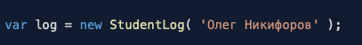

2. Создайте метод *getName*, возвращающее имя ученика: 
<br>
пример
<br>

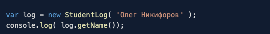

<br>
результат
<br>

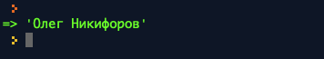

2. Создайте метод *addGrade( grade, subject )*, который будет вносить оценку 
по соответствующему предмету. При этом grade - оценка, subject - предмет. 
Метод возвращает количество поставленных оценок по данному предмету. 
Оценка ставится числом в пределах от 1 до 5. 
__При неверной оценке дополнительно выдаётся сообщение с ошибкой, 
оценка в журнал не заносится__:
<br>
__пример__
<br>

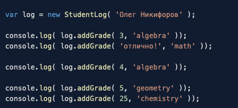

<br>
__результат__
<br>

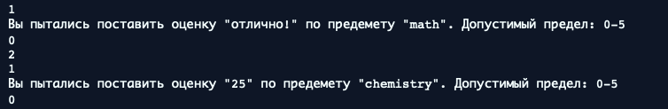

3. Создайте метод *getAverageBySubject( subject )*, 
получающий среднюю оценку по названию предмета.
При отсутствии предмета нужно выдать 0:
<br>
__пример__
<br>

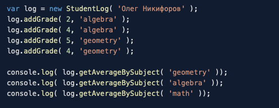

<br>
__результат__
<br>

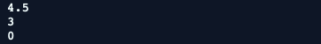

4. Создайте метод *getTotalAverage*, получающий среднюю оценку по всем предметам.
__При отсутствии предметов нужно выдать 0__:
<br>
__пример__
<br>

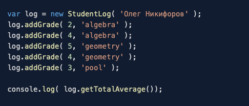

<br>
__результат__
<br>

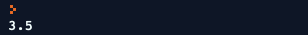

5. Создайте метод *getGradesBySubject( subject )*, 
возвращающий список всех оценок по предмету. __При отсутствии предмета в журнале,
необходимо вернуть пустой массив__:
<br>
__пример__
<br>

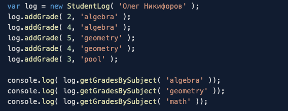

<br>
__результат__
<br>

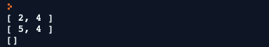

6. Создайте метод *getGrades*, возвращающий список всех оценок по всем предметам.
__В случае отсутствия оценок метод должен вернуть пустой объект__:
<br>
__пример__
<br>

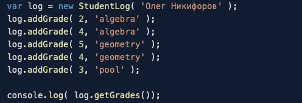

<br>
__результат__
<br>


### Критерии выполнения

Реализованы все методы, в каждом из которых вы привели примеры работы
исключительных случаев (неверный формат оценки, несуществующий предмет и т.д).

## Задача №2. RPG-персонажи

Известный нам по прошлым задачам Вася решил создать школьную RPG игру и решил начать с разработки персонажей. 
Он также продумал способ получения денег - за счёт продажи персонажей с улучшенными характеристиками.
Чтобы помочь Васе, вам необходимо реализовать базовый класс Player со следующими характеристиками:

- жизнь
- мана
- скорость
- атака
- ловкость
- удача

Также вам необходимо сделать основных персонажей:

1. Воина
2. Мага
3. Лучника

и улучшенных:

1. Гнома - усиленного Воина
2. Демиурга - улучшенного Мага
3. Арбалетчик - усиленный Лучник

### Процесс реализации

#### Оружие

В игре присутствуют меч, лук и посох, а также их улучшенные версии: длинный меч, длинный лук и посох.

1. Реализуйте базовый класс *Weapon* со следующими свойствами:
    1. *name*
    2. *attack*
    3. *durability*
    4. *range*
    
2. Создайте метод *takeDamage( damage )*, добавляющий повреждение от соперника. 
Всё повреждение уменьшает значение прочности оружия (свойство *durability*).
Значение durability не должно падать ниже 0:
<br>
__пример 1__
<br>

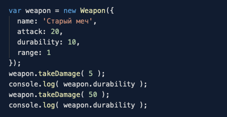

<br>
__результат 1__
<br>

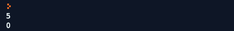

<br>
__пример 2__ (значения свойств оружия см. в табл. 1 ниже)
<br>

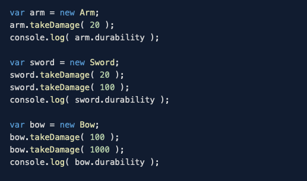

<br>
__результат 2__
<br>

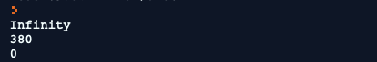

3. Создайте метод *getDamage()*, рассчитывающий урон от удара данным оружием.
Если прочность оружия (*durability*) больше или равна 30% от изначального, необходимо выдать значение
свойства attack иначе ```attack / 2```. При прочности менее 0, метод возвращает 0.
<br>
__пример__ (значения свойств оружия см. в табл. 1 ниже)
<br>

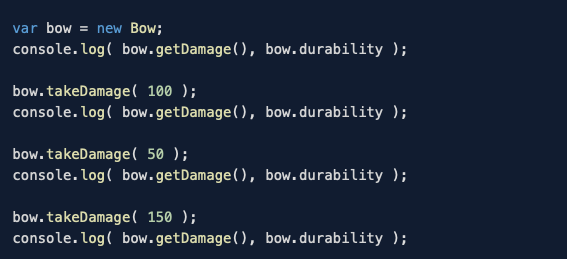

<br>
__результат__
<br>

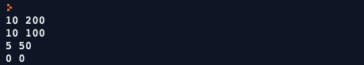

4. Создайте метод *isBroken()*, показывающий, сломано ли оружие. Возвращает *true* при durability более 0.

5. Реализуйте наследуемые от класса *Weapon* классы из __таблицы 1__.

6. Реализуйте наследуемые классы улучшенного оружия из __таблицы 2__.

Таблица 1. Классы оружия.

| class      | name       | attack | durability | range |
|------------|------------|--------|------------|-------|
| Arm        | Рука       | 1      | Infinity   | 1     |
| Bow        | Лук        | 10     | 200        | 3     |
| Sword      | Меч        | 25     | 500        | 1     |
| Knife      | Нож        | 5      | 300        | 1     |
| Staff      | Посох      | 8      | 300        | 2     |

Таблица 2. Классы усиленного оружия. Прочерк («-») - свойство берётся из __наследуемого__ класса.

| class      | наследуется от | name           | attack | range | durability |
|------------|----------------|----------------|--------|-------|------------|
| LongBow    | Bow            | Длинный лук    | 15     | 4     | -          |
| Axe        | Sword          | Секира         | 27     | -     | 800        |
| StormStaff | Staff          | Посох Бури     | 10     | 3     | -          |

#### Персонажи

1. Реализуйте базовый класс *Player* со следующими свойствами и их начальными значениями:
    1. life = 100
    2. magic = 20
    3. speed = 1
    4. attack = 10
    5. agility = 5
    6. luck = 10
    8. description = 'Игрок'
    9. weapon = new Arm
    10. name
    
2. Создайте метод *getLuck()*, возвращающий коэффициент удачливости. Метод должен возвращать
```(randomNumber + luck) / 100```, где randomNumber - случайное число от 0 до 100, а luck - 
 удача игрока (свойство *luck*).
<br>
__пример__
<br>


<br>
__результат__
<br>

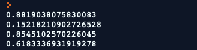
 
3. Создайте метод *getDamage( distance )*, рассчитывающий силу удара по формуле:
```( attack + weaponDamage ) *  getLuck() / distance```. *distance* - расстояние между игроками, 
*weaponDamage* - значение урона текущего оружия у игрока ( *weapon.getDamage()*).
При значении *distance*, превышающем свойство range оружия, метод возвращает 0:
<br>
__пример__
<br>

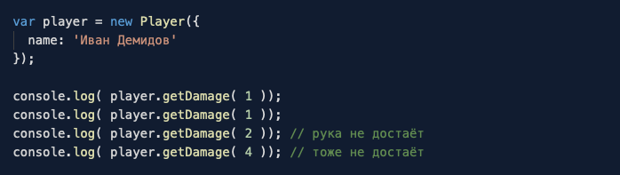

<br>
__результат__
<br>

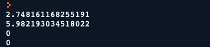

4. Создайте метод *takeDamage( damage )*, принимающий полученный урон. Урон полностью вычитается из здоровья
персонажа. Значение здоровья персонажа не может падать меньше 0.
<br>
__пример__
<br>

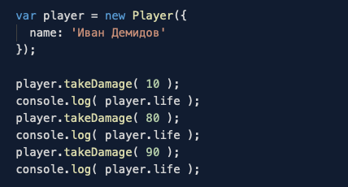

<br>
__результат__
<br>

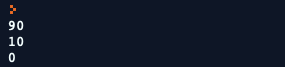

5. Создайте метод *isDead()*, возвращающий true при уровне жизни, равном 0.

6. Реализуйте наследуемые от класса *Player* классы из __таблицы 3__.

7. Реализуйте улучшенные классы игроков из __таблицы 4__.

Таблица 3. Классы бойцов. Прочерк («-») - свойство берётся из базового класса.

| class      | life | magic | speed | attack | agility | luck | description | weapon     | Основное оружие       |
|------------|------|-------|-------|--------|---------|------|-------------|------------|-----------------------|
| Warrior    | 120  | -     | 2     | 10     | -       | -    | Воин        | new Sword  | Sword -> Knife -> Arm |
| Archer     | 80   | 35    | -     | 5      | 10      | -    | Лучник      | new Bow    | Bow -> Knife -> Arm   |
| Mage       | 70   | 100   | -     | 5      | 8       | -    | Маг         | new Staff  | Staff -> Knife -> Arm |


Таблица 4. Классы улучшенных бойцов. Прочерк («-») - свойство берётся из __наследуемого__ класса.

| class       | наследуется от | life | magic | speed | attack | agility | luck | description    | weapon         | Основное оружие            |
|-------------|----------------|------|-------|-------|--------|---------|------|----------------|----------------|----------------------------|
| Dwarf       | Warrior        | 130  | -     | -     | 15     | -       | 20   | Гном           | new Axe        | Axe -> Knife -> Arm        |
| Crossbowman | Archer         | 85   | -     | -     | 8      | 20      | 15   | Арбалетчик     | new LongBow    | LongBow -> Knife -> Arm    |
| Demiurge    | Mage           | 80   | 120   | -     | 6      | -       | 12   | Демиург        | new StormStaff | StormStaff -> Knife -> Arm |

#### Особенности Классов

1. *Archer.getDamage( distance )*: сила удара рассчитывается по формуле
     ```( attack + weaponDamage ) * getLuck() * distance / weaponRange```
     
2. *Warrior.takeDamage( damage )*: при уровне здоровья менее 50% и *getLuck()* > 0.8, урон вычитается из маны,
        а не из здоровья.
        (свойство magic). При нулевом значении маны урон вычитается из здоровья
    <br>
    __пример__
    <br>

    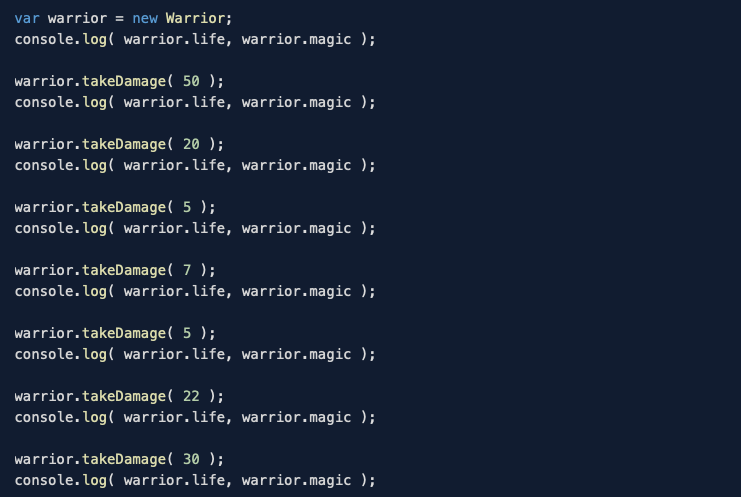
    
    <br>
    __результат__
    <br>
    
    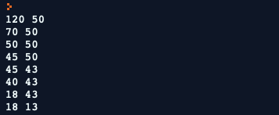
    
3.  *Mage.takeDamage( damage )*: При уровне маны более 50%, маг получает урон в 1.5 раза меньше базового и 
    уменьшает значение маны на 12.
    <br>
    __пример__
    <br>
    
    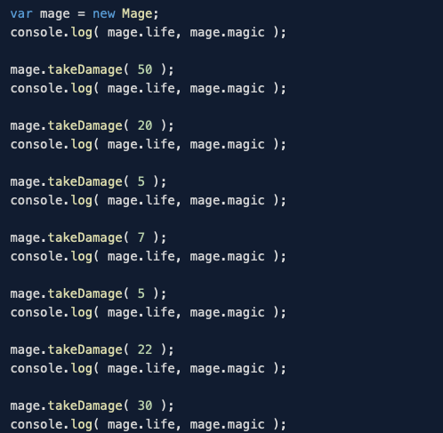
    
    <br>
    __результат__
    <br>
    
    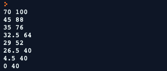
    
4. *Dwarf.takeDamage()*: Каждый шестой удар соперника наносит в 2 раза меньше урона при *getLuck()* > 0.5.

5. *Demiurge.getDamage()*: При уровне маны > 0, наносимый урон в 1.5 выше при getLuck() > 0.6. 

### Критерии выполнения

Вы реализовали все классы с учётом изменённых методов в улучшенных классах. Вы проверили пограничные случаи
(уровень здоровья меньше 0, уровень магии меньше 0). 

### Примеры

## Задача №3. RPG-поединки

Вася решил устроить состязания между своими персонажами. Пока все они - искусственный интеллект.
Он научил их атаковать и защищаться. Реализуйте методы удар(), защита() и заклинание(), 
которые бы принимали в качестве аргумента экземпляры других классов и, в зависимости от уровня удачи,
уменьшали бы имеющиеся у персонажей показатели.

### Процесс реализации

Потребуется реализовать методы для удара, а также игровое поле, на котором будет происходить битва.
Игровое поле простое: игроки двигаются либо влево, либо вправо. На поле может быть несколько игроков,
поэтому нам потребуется обучить игроков выбирать соперника.

__Player__

1. Добавьте базовому классу *Player* дополнительное свойство *position* - положение игрока на оси координат.
Игроки смогут двигаться по этой оси только влево и вправо.

2. Добавьте метод *moveLeft( distance )* и *moveRight( distance )*. За один вызов игрок может сместиться
на расстояние *distance*, но не более значения свойства *speed*. *moveLeft()* уменьшает значение *position*,
*moveRight()* увеличивает:
<br>
__пример__
<br>

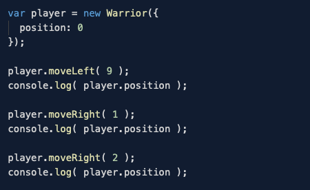

<br>
__результат__
<br>

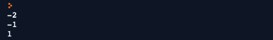

3. Добавьте метод *move( distance )*. Если distance меньше нуля, вызывается *moveLeft( distance )*, иначе
и *moveRight( distance )*.

4. Реализуйте метод *isAttackBlocked()*, который покажет, получилось ли игроку заблокировать удар
соперника. Верните *true* в случае, если *getLuck()* больше значения ( 100 - luck ) / 100, в ином случае - false. 
<br>
__пример__
<br>

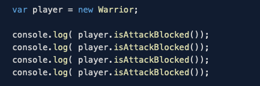

<br>
__результат__
<br>

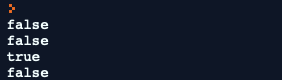

5. Реализуйте метод *dodged()*, показывающий, получилось ли игроку уклониться от атаки.
Верните true в случае, если *getLuck()* больше значения ```(100 - agility - speed * 3) / 100```, 
в ином случае - false.

6. Реализуйте метод *takeAttack( damage )*, который наносит удар другому игроку. 
Работа метода идёт в следующем порядке:
    1. Если атака была заблокирована (*isAttackBlocked*), урон приходится по оружию (weapon.takeDamage).
    2. Если произошло уклонение (*dodged*), урон не засчитывается
    3. В иных случаях игрок получает урон, равный damage

7. Реализуйте метод *checkWeapon*. В случае, если оружие износилось (*weapon.isBroken*), 
игрок получает следущее классом ниже. Так, для класса *Warrior* это будет 
*Sword* -> *Knife* -> *Arm*. Детали смотрите в колонке «Основное оружие» соответствующего класса.
P.S. У всех есть нож и голые руки. Руки не изнашиваются (у него *durability* = Infinity).

8. Создайте метод *tryAttack( enemy )*, который реализует атаку игроком.
    1. Рассчитать расстояние между игроком и врагом (*distance*). Расстояние между игроками всегда больше 0
    2. Если дальность оружия (*weapon.range*) не достаёт (больше distance) до врага, атака не засчитывается
        и метод прекращает работу.
    3. В ином случае запишите износ оружию (*weapon.takeDamage*) на ```10 * getLuck()```
    4. Нанесите урон (*getDamage*) противнику (*enemy.takeAttack*)
    5. Если игроки имеют одно и то же положение (*position*), атакуемый отскакивает 
        на 1 деление вправо и принимает урон (*enemy.takeAttack*) с удвоенной силой (```damage * 2```)
    <br>
    __пример 1__
    <br>
  
    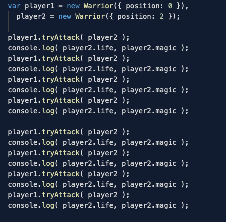
    
    <br>
    __результат 1__
    <br>
    
    
    
    <br>
    __пример 2__
    <br>
    
    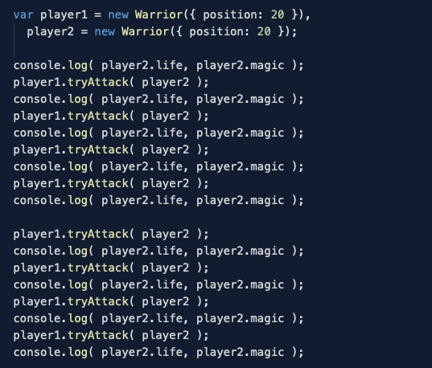
    
    <br>
    __результат 2__
    <br>
    
    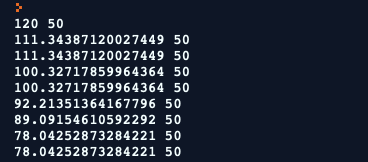

9. Реализуйте метод *chooseEnemy( players )*, где players - массив живых игроков на поле.
    (в том числе сам игрок!). Выбирает противника с минимальным здоровьем.
    
10. Реализуйте метод *moveToEnemy( enemy )*, котрый осуществляет движение по направлению к врагу.

11. Реализуйте метод *turn( players )* в соответствии с правилами каждого класса.
    Каждый ход игрок совершает следующую последовательность действий (именно в таком порядке): 
    выбирает врага (*chooseEnemy*), двигается (*moveToEnemy*), наносит удар (*tryAttack*).
    
12. Реализуйте функцию *play( players )*, которая будет определять победителя. 
Также добавьте сообщения в методы *Player* для удобного вывода для наблюдения королевской битвы.
<br>
__пример__
<br>

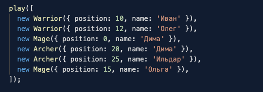

<br>
__результат (часть вывода)__
<br>

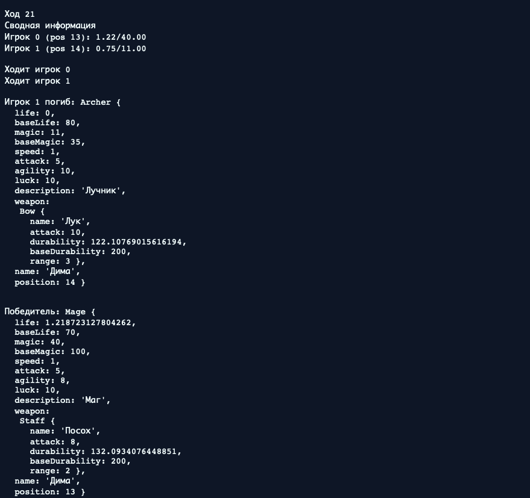

### Критерии выполнения

Протестированная функция *play* с игроками всех классов на поле. Проверьте работу игры на 2, 3 и 6 игроках.

## Требования для выполнения домашней работы

* браузер;
* редактор кода, например [Sublime][1] или [Visual Studio Code][2];
* аккаунт на [GitHub][0] ([инструкция по регистрации на GitHub][3]);
* система контроля версий [Git][4], установленная локально ([инструкция по установке Git][5]);

## Начало работ

1. Создать репозиторий на [GitHub][0]. Параметры создаваемого репозитория:
* Repository name: `bjs-homeworks`;
* Access level: Public;
* Initialize this repository with a README: No;
* Add .gitignore: None;
* Add a license: None;
После нажатия на кнопку `Create repository`, вы будете переведены на страницу вновь созданного репозитория.
URL адрес текущей страницы будет являться URL адресом вашего репозитория.
Пример URL адреса репозитория: `https://github.com/username/bjs-homeworks`, где `username` - имя вашего профиля GitHub, `bjs-homeworks` - название репозитория. Далее по тексту адрес вашего репозитория будет иметь обозначение: `%repo-url%`.
2. Создать директорию на вашем компьютере, в которой вы планируете выполнять домашние задания.
3. Открыть созданную директорию с помощью терминала или командной строки вашей операционной системы.
4. Клонировать репозиторий с домашними заданиями с помощью команды `git clone https://github.com/netology-code/bjs-homeworks` в открывшемся терминале или командной строке.
5. Перейти в директория склонированного репозитория `cd ./bjs-homeworks`.
6. Добавить репозиторий в проект `git remote add homeworks %repo-url%`, где `%repo-url%` — адрес созданного репозитория.

## Решение задач
1. Перейти в папку задания, например, для первого задания `cd ./variables`.
2. Открыть файл `main.js` в вашем редакторе кода и выполнить задание.
3. Открыть файл `index.html` в вашем браузере и с помощью консоли DevTools убедиться в правильности выводимых результатов.
4. Добавить файл `main.js` в индекс git с помощью команды `git add %file-path%`, где %file-path% - путь до целевого файла, например, для первого задания `git add variables/main.js`.
5. Сделать коммит используя команду `git commit -m '%comment%'`, где %comment% - это произвольный комментарий к вашему коммиту, например, для первого задания 'first commit variables'.
6. Опубликовать код в репозиторий homeworks с помощью команды `git push -u homeworks master`.
7. Прислать ссылку на репозиторий через личный кабинет на сайте [Нетологии][6].

[0]: https://github.com/
[1]: https://www.sublimetext.com/
[2]: https://code.visualstudio.com/
[3]: https://github.com/netology-code/guides/blob/master/git/github.md
[4]: https://git-scm.com/
[5]: https://github.com/netology-code/guides/blob/master/git/REAMDE.md
[6]: https://netology.ru/
